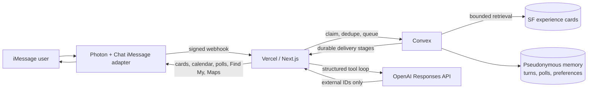

# COAST

COAST is an unofficial AI concierge for San Francisco, delivered over iMessage. It uses Photon for the native messaging surface, raw OpenAI Responses behind an application-owned runtime, and Convex for the SF serving database and all durable operational state.

The implementation contract is documented in this repository’s source, tests, and architecture notes below.

## Architecture



### Conversation flow

1. A signed Photon webhook is verified at Vercel; Convex atomically claims and deduplicates the inbound message.
2. COAST marks the message read, reacts, and keeps typing active while the durable turn runs.
3. The agent searches `sfExperienceCards` through bounded indexes and returns only source-backed external IDs.
4. When the next step is a clear set of choices, COAST sends one native poll instead of listing alternatives in prose. Verified matches are rendered as result cards, with one calendar attachment per event.
5. A “near me” or directions request sends one native Find My request. A consented, fresh location is used only in the serverless resolver to rank public destinations or make a Maps handoff; exact origin never enters Convex, OpenAI, logs, or outbound URLs.

## Experience guarantees

- Results are source-backed; model output cannot create destination URLs.
- Native result cards, calendar attachments, polls, location requests, and Maps cards are persisted as idempotent delivery stages before sending.
- HMAC-pseudonymized users, preferences, threads, and delivery records live in Convex. Raw message text expires after 30 days; `FORGET ME` clears the user’s saved state.
- The beta is 1:1 DM only, uses Photon’s free shared line, and sends third-party ticket/reservation links rather than processing payments.

## Local validation

```bash
pnpm install
pnpm snapshot:verify
pnpm test
pnpm lint
pnpm typecheck
pnpm build
```

Copy `.env.example` to `.env.local` only for local development. Real values belong in Convex/Vercel encrypted environment settings and must never be committed or printed.

## Fixed dataset

The beta is locked to `snapshot-99f2d46a008bec47efae` in `../data/convex/snapshots/`. It contains 129 places, 444 event series, 514 event occurrences, 107 explicit recommendations, and 636 serving experience cards. All nine source collections total 251,679 documents.

`sfExperienceCards` is the recommendation hot path. `sfSourceClaims` is provenance storage and must never be scanned during a live recommendation.

### Verified import

The importer always validates checksums, row counts, privacy, and cross-document references before touching Convex. It then replaces all nine tables individually and advances `sfDatasetState` only after every import exits successfully. If any step fails, the prior dataset pointer remains active.

```bash
# Personal Convex dev deployment
pnpm snapshot:import -- --yes

# Approved COAST production deployment; both flags are mandatory
pnpm snapshot:import -- --prod --yes
```

`COAST_INTERNAL_SERVICE_SECRET` must already be loaded from a secure environment manager. The importer sends it directly to Convex for the final attestation, never prints it, and rejects secrets supplied as command arguments. Do not paste this or any other secret into chat.

## Runtime endpoints

- `GET /api/health` — redacted configuration readiness.
- `POST /api/imessage/webhook` — signed Photon delivery endpoint.
- `POST /api/internal/agent` — service-authenticated Responses runtime.
- `POST /api/internal/delivery` — service-authenticated Photon delivery bridge.

The webhook is a Node route. The Photon adapter verifies the exact raw request body and its five-minute signature window. Convex claims every delivery before any acknowledgment or generation work.

### Outbound idempotency limitation

Convex reserves outbound work with the deterministic key `<turnId>:<stage>`, and the internal Vercel delivery route rejects a mismatched key. This is not provider-level exactly-once delivery. In the pinned `@photon-ai/chat-adapter-imessage@3.2.0` API, `postMessage(threadId, message)` and `openModal(triggerId, modal, contextId?)` expose no send-options argument. Spectrum 10's public `Space.send(content)` path likewise exposes no `clientMessageId`, even though the lower-level `@photon-ai/advanced-imessage@1.0.0` client supports it for text and poll creation.

Do not reach through Spectrum's private `__internal` platform registry to work around this. The current Convex recovery loop retries failed or timed-out sends, so an ambiguous Photon timeout can produce a duplicate provider message. Public launch therefore requires either an adapter/Spectrum release that forwards a stable `clientMessageId`, or a separately reviewed direct-client transport. Until then, treat ambiguous sends as potentially delivered and do not claim end-to-end exactly-once messaging.

## Deployment boundaries

The beta uses a free Photon shared line. Do not upgrade or provision a dedicated public number without separate authorization. COAST returns existing third-party reservation/ticket URLs and does not process payments.

## Current cloud state

- Vercel project: `5dee-studios/mayor`, with the stable production URL [mayor-blue.vercel.app](https://mayor-blue.vercel.app).
- Convex project: `gratitud3-eth/mayor`; production deployment `acoustic-mastiff-766` has `snapshot-99f2d46a008bec47efae` active with all 251,679 documents.
- Photon project: `mayor` on the free shared-line tier. The production webhook URL is `https://mayor-blue.vercel.app/api/imessage/webhook`.

The live beta has the required secure provider configuration. Credentials belong only in encrypted Vercel and Convex environment settings; never commit them, print them, include them in terminal arguments, or paste them into chat.

Current implementation includes source-backed cards, calendar attachments, native clarification polls, read states, typing, Find My nearby-search and directions handoff, and durable outbound recovery. Automated refresh scraping, embeddings, public launch, and a dedicated COAST phone line remain separate milestones.
