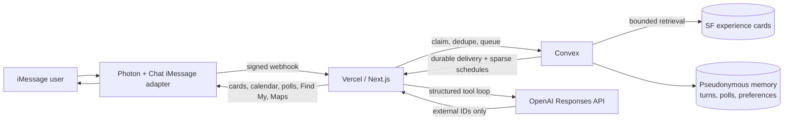

# COAST

COAST is San Francisco’s unofficial mayor, delivered over iMessage. It uses Photon for the native messaging surface, raw OpenAI Responses behind an application-owned runtime, and Convex for the SF serving database and all durable operational state.

The implementation contract is documented in this repository’s source, tests, and architecture notes below.

## Shared COAST soul

`SOUL.md` is the source of truth for COAST’s Bay Area identity and dictionary. Edit that Markdown, run `pnpm soul:generate`, and verify freshness with `pnpm soul:check`; CI includes the freshness check. The generated TypeScript constant is imported by the prompt composer, so production never reads a prompt file from disk. `composeCoastSystemPrompt("imessage" | "voice" | "livestream")` reuses the same soul while keeping each channel’s output rules separate. Voice and livestream compositions are ready for future transports; this release integrates the iMessage channel only.

## Architecture



### Conversation flow

1. A signed Photon webhook is verified at Vercel; Convex atomically claims and deduplicates the inbound message.
2. COAST marks the message read, reacts, and keeps typing active while the durable turn runs.
3. The agent searches `sfExperienceCards` through bounded indexes and returns only source-backed external IDs.
4. When the next step is a clear set of choices, COAST sends one native poll instead of listing alternatives in prose. A vote starts typing immediately and settles for two seconds, so changing the selection revises the same durable turn instead of sending two answers.
5. Verified matches render as native cards. Event results and user-requested place holds can be added to Apple Calendar in one tap; every `.ics` includes a 15-minute reminder and is followed by a source-backed registration, reservation, or phone-confirmation action. Calendar holds never claim availability.
6. Opted-in post-visit check-ins and six-hour inactivity scans run in Convex. Idle nudges require prior taste signals, respect 10 AM–10 PM SF quiet hours, are capped at one per six hours, and skip stopped, stale, or currently active conversations.
7. A “near me” or directions request sends one native Find My request. A consented, fresh location is used only in the serverless resolver to rank public destinations or make a Maps handoff; exact origin never enters Convex, OpenAI, logs, or outbound URLs.

## Creative generation

COAST accepts `/imagine` for GMI images and one-image edits, `/zap` for 15-second Fal MiniMax H3 videos, and `/draw` for a hosted Photon mini-app canvas. Draw defaults to **Flare Fast** (`gpt-image-2.5-flare`, low quality, JPEG at 85%), with **Flare Detailed** (medium quality), **Turbo · 4 steps** (`fal-ai/z-image/turbo`), and **Sunburst HQ** (`gpt-image-2.5-sunburst`, high quality) as explicit alternatives; none silently fall back to another model. Flare and Sunburst store real OpenAI partials, while Turbo reports durable provider states and its actual final image. Every distinct `/draw` message creates a new blank 15-minute workspace; opening it costs nothing. A finished Draw settles one image allowance or $0.50 when its authenticated final artifact becomes available in the mini-app. **Save to iMessage** only delivers that existing image and never charges again. **Animate** starts an independent `/zap` video from that private result, so one image and one video may run at the same time. Photon’s URL mini-app is the production Messages surface today; the native PencilKit Messages extension activates only after signing and installation. Each user receives 10 images and 10 videos per rolling 24 hours. After an allowance is exhausted, images cost $0.50 and videos cost $1.00 from purchased credit; a fixed $9.99 Stripe Checkout top-up grants $10.00 credit. Link wallet onboarding is optional and begins only when the user selects Connect Link. Creative prompts and media are isolated from concierge context; previews expire within 15 minutes, and inputs and outputs expire within 24 hours. `/draw` admission is independently controlled by `COAST_DRAW_ENABLED`.

`/edit <instruction>` creates an immediate Draw revision from the newest completed result in the same iMessage conversation and returns a fresh review card; one attached image starts a separate edit workspace. The revision strip is branchable, so selecting an older result never overwrites later work. Flare and Sunburst follow-ups use a stateless `gpt-5.6-luna` Responses call with encrypted branch instructions, the selected private image, an image-generation edit tool, and real partial previews. This path is controlled by `COAST_DRAW_MULTITURN_ENABLED` (off until canaries pass); `COAST_DRAW_MULTITURN_MODEL` defaults to `gpt-5.6-luna`. Turbo continues on the existing four-step Fal path. Save remains an explicit, free delivery action.

## Experience guarantees

- Results are source-backed; model output cannot create destination URLs.
- Native result cards, calendar attachments, polls, location requests, and Maps cards are persisted as idempotent delivery stages before sending.
- HMAC-pseudonymized users, preferences, threads, and delivery records live in Convex. Raw message text expires after 30 days; `FORGET ME` clears the user’s saved state.
- The beta is 1:1 DM only and uses Photon’s free shared line. Third-party ticket/reservation links remain source-backed; creative top-ups are processed through the fixed Stripe Checkout flow.

## Local validation

```bash
pnpm install
pnpm snapshot:verify
pnpm test
pnpm lint
pnpm typecheck
pnpm build
```

Copy `.env.example` to `.env.local` only for local development. Real values belong in Convex/Vercel encrypted environment settings and must never be committed or printed.

Creative deployment settings are `COAST_CREATIVE_RUNTIME_URL`, `COAST_DRAW_RUNTIME_URL`, `COAST_DRAW_ENABLED`, `COAST_DRAW_MODEL`, `COAST_DRAW_TLDRAW_ENABLED`, `COAST_DRAW_TLDRAW_LICENSE_KEY`, `COAST_CREATIVE_CLEANUP_URL`, `OPENAI_API_KEY`, `GMI_CLOUD_API_KEY`, `GMI_REQUEST_QUEUE_URL`, `FAL_KEY`, `GROQ_API_KEY` (optional prompt compiler), `BLOB_READ_WRITE_TOKEN`, `COAST_PUBLIC_URL`, `STRIPE_SECRET_KEY`, and `STRIPE_WEBHOOK_SECRET`. `COAST_DRAW_MODEL` defaults to `gpt-image-2.5-flare`; do not silently substitute another model when Flare access is unavailable. The Toolcraft-inspired controls are production UI; the client-only tldraw adapter remains disabled until both `COAST_DRAW_TLDRAW_ENABLED=true` and a valid production license are configured. A live transcript card additionally uses `COAST_DRAW_APPLE_TEAM_ID`, `COAST_DRAW_EXTENSION_BUNDLE_ID`, and the optional `COAST_DRAW_APP_STORE_ID`; the values must match the signed target under `ios/CoastDraw`. Convex must also hold the matching `COAST_CONVEX_SERVICE_SECRET`; Link CLI runtime files are packaged through the pinned `@stripe/link-cli` dependency.

## Operations dashboard

The private dashboard at `/admin` is organized around a searchable, paginated user directory. Select a person to open a refresh-safe profile at `/admin/users/[userId]`. Profiles show four tabs: **Overview**, **Activity**, **Generations**, and **Billing**. The overview presents purchased credit, independent free image/video allowance, unresolved reservations, and any active creative request. Activity can be narrowed to one verified conversation; generations show command, model/mode, funding source, delivery state, and outcome; billing groups Checkout or connected-Link purchases with their ledger and payment events. Visible data refreshes every 15 seconds without changing the selected user or pagination.

Access uses an eight-hour Secure, HttpOnly session. Store only the SHA-256 hash of the access key in the production Convex environment as `COAST_ADMIN_PASSWORD_HASH`. Login attempts are rate limited per client. Rotate the key by replacing that hash; existing browser sessions expire independently after eight hours.

The authenticated Vercel routes decrypt a verified iMessage thread reference only to format the user phone/email and originating Photon line for an operator. Convex and browser record views use pseudonymous user IDs. A Photon `shared` line is labeled as shared rather than represented as a phone number. All record filters apply on the server before pagination, including delivery and payment-event ownership, so records do not disappear when newer activity belongs to someone else.

The dashboard is deliberately read-only. Its view models are allowlisted: prompts, message bodies, private media, checkout URLs, wallet credentials, encrypted payloads, and raw identity references never reach the browser. Expandable details contain only technical IDs, timestamps, and sanitized error codes.

## Fixed dataset

The beta is locked to `snapshot-99f2d46a008bec47efae` in `../data/convex/snapshots/`. It contains 129 places, 444 event series, 514 event occurrences, 107 explicit recommendations, and 636 serving experience cards. All nine source collections total 251,679 documents.

`sfExperienceCards` is the recommendation hot path. `sfSourceClaims` is provenance storage and must never be scanned during a live recommendation.

### Verified import

The importer always validates checksums, row counts, privacy, and cross-document references before touching Convex. It then replaces all nine tables individually and advances `sfDatasetState` only after every import exits successfully. If any step fails, the prior dataset pointer remains active.

```bash
# Personal Convex dev deployment
pnpm snapshot:import -- --yes

# Approved COAST production deployment; both flags are mandatory
pnpm snapshot:import -- --prod --yes
```

`COAST_INTERNAL_SERVICE_SECRET` must already be loaded from a secure environment manager. The importer sends it directly to Convex for the final attestation, never prints it, and rejects secrets supplied as command arguments. Do not paste this or any other secret into chat.

## Runtime endpoints

- `GET /api/health` — redacted configuration readiness.
- `POST /api/imessage/webhook` — signed Photon delivery endpoint.
- `POST /api/internal/agent` — service-authenticated Responses runtime.
- `POST /api/internal/creative` — service-authenticated GMI/Fal creative worker with private Blob materialization.
- `POST /api/internal/draw` — 300-second service-authenticated Draw worker for Flare, Sunburst, and durable Turbo submit/poll phases.
- `POST /api/internal/delivery` — service-authenticated Photon delivery bridge.
- `GET /api/stripe/creative-topup?order_id=...` — fixed $9.99 Checkout redirect for a server-owned order.
- `POST /api/stripe/webhook` — raw-body verified Stripe settlement endpoint.
- `POST /api/admin/session` — same-origin, rate-limited admin login.
- `GET /api/admin/users`, `POST /api/admin/users/search`, and `GET /api/admin/users/:userId/summary` — authenticated directory, exact identity lookup, and privacy-projected profile summary.
- `GET /api/admin/users/:userId/conversations`, `GET /api/admin/records`, and `GET /api/admin/records/:recordId/related` — authenticated, server-filtered profile activity and on-demand record details.

The webhook is a Node route. The Photon adapter verifies the exact raw request body and its five-minute signature window. Convex claims every delivery before any acknowledgment or generation work.

### Outbound idempotency limitation

Convex reserves outbound work with the deterministic key `<turnId>:<stage>`, and the internal Vercel delivery route rejects a mismatched key. This is not provider-level exactly-once delivery. In the pinned `@photon-ai/chat-adapter-imessage@3.2.0` API, `postMessage(threadId, message)` and `openModal(triggerId, modal, contextId?)` expose no send-options argument. Spectrum 10's public `Space.send(content)` path likewise exposes no `clientMessageId`, even though the lower-level `@photon-ai/advanced-imessage@1.0.0` client supports it for text and poll creation.

Do not reach through Spectrum's private `__internal` platform registry to work around this. The current Convex recovery loop retries failed or timed-out sends, so an ambiguous Photon timeout can produce a duplicate provider message. Public launch therefore requires either an adapter/Spectrum release that forwards a stable `clientMessageId`, or a separately reviewed direct-client transport. Until then, treat ambiguous sends as potentially delivered and do not claim end-to-end exactly-once messaging.

## Deployment boundaries

The beta uses a free Photon shared line. Do not upgrade or provision a dedicated public number without separate authorization. COAST returns existing third-party reservation/ticket URLs and processes fixed-price creative top-ups through Stripe Checkout, with optional Link wallet approval after a user chooses it.

## Current cloud state

- Vercel project: `5dee-studios/mayor`, with the stable production URL [mayor-blue.vercel.app](https://mayor-blue.vercel.app).
- Convex project: `gratitud3-eth/mayor`; production deployment `acoustic-mastiff-766` has `snapshot-99f2d46a008bec47efae` active with all 251,679 documents.
- Photon project: `mayor` on the free shared-line tier. The production webhook URL is `https://mayor-blue.vercel.app/api/imessage/webhook`.

The live beta has the required secure provider configuration. Credentials belong only in encrypted Vercel and Convex environment settings; never commit them, print them, include them in terminal arguments, or paste them into chat.

Current implementation includes source-backed cards, calendar attachments, native clarification polls, read states, typing, Find My nearby-search and directions handoff, and durable outbound recovery. Automated refresh scraping, embeddings, public launch, and a dedicated COAST phone line remain separate milestones.
# Draw model options

Draw offers Flare Fast (low quality), Flare Detailed (medium quality), and Z-Image Turbo through Fal. Turbo uses four inference steps, one square image, the safety checker, and strength 0.6 for sketches/imports. It chooses `fal-ai/z-image/turbo/image-to-image` for canvas input and `fal-ai/z-image/turbo` for text alone. All options share the existing image allowance and credit price. Turbo publishes its final image; progressive previews remain a Flare feature.

Reopening a consumed launch link recovers an existing valid session cookie. An expired or missing cookie requires a fresh `/draw` link. Generate displays preparation, prevents duplicate taps, and reports connection failures. Completion enters `ready_for_save`; Save is idempotent, reopens the durable delivery turn, and settles the generation only after Photon confirms the native attachment.
